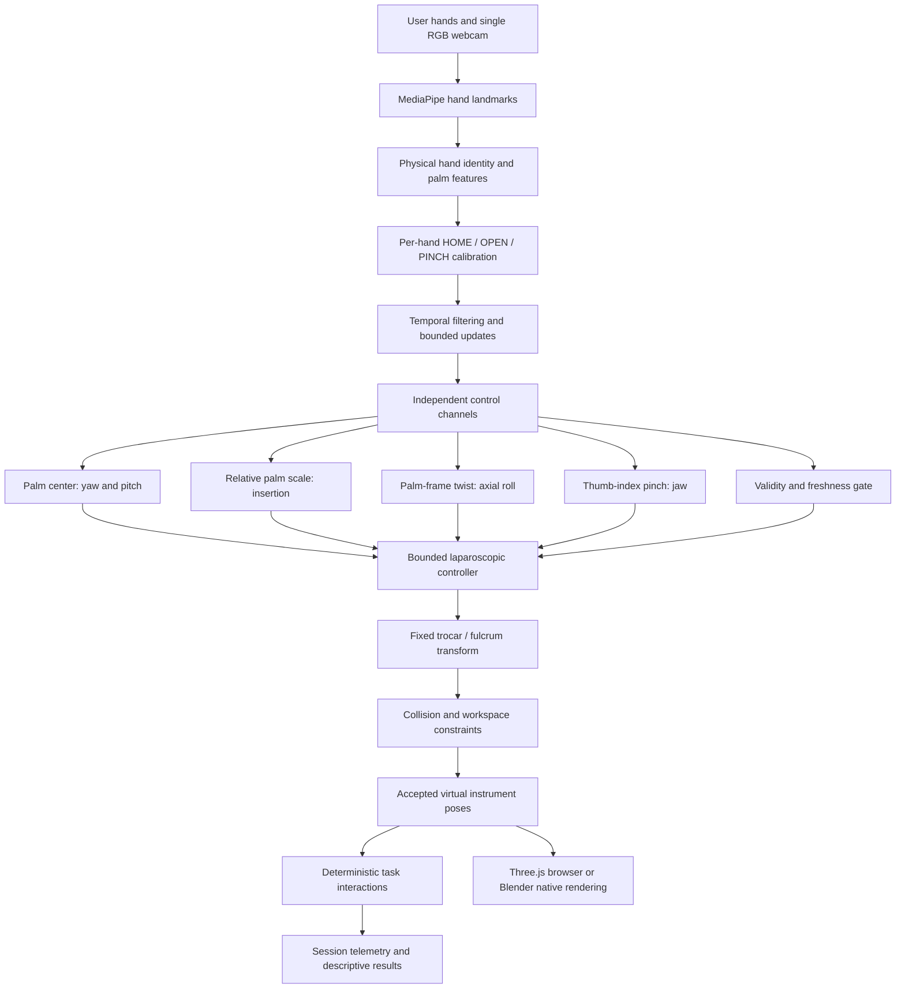

## LapSim-AI v0.1.0 — Research Preview

[](https://doi.org/10.5281/zenodo.22724948)

**Live demo:** https://lapsim-ai.live

LapSim-AI is an experimental webcam-controlled virtual laparoscopic skills trainer developed for educational and research exploration. It uses an ordinary RGB webcam and calibrated hand motion to control virtual laparoscopic instruments.

The browser version processes webcam frames, hand landmarks, calibration data, and training-session results locally. MediaPipe Tasks Vision contains internal usage/performance metrics logic; LapSim-AI's production Content Security Policy (CSP) prevents its worker from transmitting metrics to the external MediaPipe metrics endpoint when the configured policy is served and enforced.

> **Research disclaimer:** LapSim-AI has not been clinically validated, is not a certified medical device, and is not a replacement for supervised surgical training. It must not be used for patient care or clinical decision-making.
 
 Original maintainer-owned work is licensed under Apache-2.0; third parties retain their own terms.

LapSim-AI explores an accessible way to interact with virtual laparoscopic instruments using an ordinary RGB webcam and calibrated hand motion. It requires no stereo/depth camera, VR controller, hand-mounted controller or physical laparoscopic instrument. It provides no haptic feedback.

## Two implementations

| Implementation | Runtime and purpose | Current task |
| --- | --- | --- |
| Native research / reference | Python, MediaPipe/OpenCV and Blender; engineering reference, scene builders, deterministic mechanics, guided setup and telemetry | Structured six-ring Peg Transfer |
| Browser public | TypeScript, Vite, Three.js and MediaPipe Tasks Vision; client-side camera processing, rendering, calibration, instruments and results | Beginner Free Transfer |

The browser application is a browser-native implementation of the control and simulator concepts, with fixture-based checks against native behavior. **It is not Blender streamed into a webpage.** Python and Blender are not needed to use it. Earlier anatomy scenes remain separate historical research checkpoints.

## Architecture



The palm center uses wrist landmark 0 at 40% and MCP landmarks 5, 9, 13 and 17 at 15% each. Steering excludes fingertips so opening the grasper does not directly steer the tool. Apparent palm scale relative to HOME controls insertion; palm-frame twist controls roll; thumb–index separation controls jaws. These channels are separated to reduce unwanted coupling, although landmark noise and hand pose can still couple them.

**This is calibration-relative monocular control, not a direct metric measurement of physical hand depth from the camera.** Virtual scene metres do not make webcam measurements metric. The [technical method](docs/technical_method.md) gives actual formulas, thresholds, transforms, differences and source locations.

## Browser quick start

From a full checkout, with Node **>=22.12.0** and **pnpm 11.19.0**:

```powershell
cd web
pnpm install --frozen-lockfile
pnpm dev
```

Open [the local trainer](http://127.0.0.1:5173). Use a desktop/laptop browser with WebGL2, webcam permission and a viewport at least 900 pixels wide. Production requires HTTPS; localhost supports development camera access. The build copies the repository's checksum-verified model and installed WASM locally. See [browser setup](web/README.md) and [reproducibility instructions](docs/development.md) for tests, builds and native setup. No public production site URL was verified in this release audit.

## Controls and calibration

Start Training → camera permission → hold both hands comfortably for HOME → hold thumb/index OPEN → hold PINCH → return near HOME → five uninterrupted seconds of LIVE countdown → practice.

Each stage needs a stable 3.75-second hold and at least 30 valid samples. Both hands commit together using medians of the latest 30 raw samples. HOME stores position, apparent palm scale and orientation; OPEN/PINCH store each hand's pinch range. Calibration reduces dependence on resting pose, framing, hand size and pinch range within accepted geometry; it does not eliminate those dependencies.

| Hand action | Instrument action |
| --- | --- |
| Translate palm right/down in mirrored preview | Positive yaw/pitch, with fulcrum response at distal end |
| Reduce apparent palm scale relative to HOME | Increase shaft insertion |
| Increase apparent palm scale | Retract shaft |
| Twist palm relative to HOME | Axial roll |
| Pinch thumb and index / open them | Close / open jaw |

Invalid or stale tracking holds the affected tool; the other valid tool can continue. **Tracking loss does not pause active practice time.** Pause explicitly when needed. Hidden tabs pause. Resume requires both valid fresh hands. Recalibrate requires pause and no held ring. Try Again clears task/results and the LIVE countdown while retaining calibration; a new camera session repeats calibration.

## Beginner Free Transfer

The public default offers **120 active seconds**, beginning on the tick of the first successful grasp. Use either instrument, any available ring and any valid unoccupied target. No handoff or source/target number matching is required. Valid target placement increments **Successful Transfers**, with visual confirmation. Source returns and drops do not count.

After 1.2 active simulation seconds, a placed ring can recycle deterministically to a clear source seat. Recycling waits for tool/ring clearance; regrasp cancels it. This is not an unconditional wall-clock delay. At expiry, task, instrument poses and result snapshot freeze. Try Again starts a fresh attempt.

**Beginner Free Transfer is an experimental LapSim-AI practice task. It is not the official FLS Peg Transfer task and is not currently a validated assessment of laparoscopic competence, proficiency or training effectiveness.** Structured six-ring architecture is preserved internally for future advanced/research development. It distinguishes matching and incorrect targets and supports handoff; its automated trial uses six handoffs, but the task logic itself does not require them.

## Telemetry

Descriptive measurements include active time, successful transfers/objects completed, grasps, releases, handoffs, drops, incorrect and successful placements, and left/right/total instrument path. Paths use accepted, constrained shaft-tip positions in virtual metres with a 0.5 mm accumulated-displacement threshold. Pauses are excluded and reanchor paths. Tracking loss continues time. Browser results and bounded histories remain in memory; native results also live in Blender scene properties. No composite skill score exists. See [telemetry semantics](docs/technical_method.md#telemetry).

## Research and validation status

Phase 6 reruns: **36 web tests, 94 native Python tests, TypeScript check and production build passed**. Native Blender Peg Transfer and guided-setup verification passed. These test deterministic engineering behavior, not training effectiveness. Numerical pivot accuracy does not establish physical or clinical realism. The [evidence and capability matrix](docs/release_evidence_v0.1.0.md) distinguish measured results, historical checks, manual observations and untested claims.

The maintainer reports a physical manual browser usability test with a positive overall impression. No dated hardware/browser protocol or quantitative results were supplied: this is a qualitative observation, not a controlled usability study. Native physical hands-free acceptance remains separately pending.

## Technical contribution

LapSim-AI explores an experimental architecture combining commodity single-RGB-camera markerless hand tracking, per-hand user-relative calibration, apparent-palm-scale monocular insertion control, decomposition of free-hand motion into laparoscopic control channels, fixed-trocar instrument kinematics, deterministic interaction constraints, and a virtual practice environment implemented in native and browser runtimes.

Novelty and patentability have not been formally determined. No priority, patent, clinical validation or training-effectiveness claim is made.

## Privacy and research interest

LapSim-AI processes webcam frames locally and does not upload webcam frames, hand landmarks, calibration data or training-session results. MediaPipe Tasks Vision performs hand-landmark inference locally. The bundled dependency contains internal usage/performance metrics logic; LapSim-AI applies a browser Content Security Policy to prevent the worker from transmitting metrics to its external metrics endpoint. This blocks transmission, not internal collection, when the configured response policy is served and enforced. The optional Research Interest form is separate and receives no automatic simulator results. Hosting providers may retain ordinary request logs. See [privacy boundaries](docs/privacy_research.md). Vercel deployment verification remains pending.

[Join the Research Interest List](https://forms.gle/Jz6Wva2JEVHcomc36) to express interest in future testing or collaboration. Joining does not enroll you in a study or provide informed consent. Simulator data is not sent to the form. Form contents, access settings and contact/removal mechanism require maintainer verification before launch. Do not submit medical or sensitive personal information.

## Limitations and disclaimer

Lighting, occlusion, camera framing, hand identity and landmark errors affect control. Apparent-scale insertion and palm-frame roll are nonmetric proxies dependent on calibration and pose. Device/GPU/browser performance varies; physical hardware coverage is limited. Collision and ring interaction are simplified deterministic constraints, without full rigid-body/tissue physics or haptics. Browser visuals are procedural. Construct validity, predictive validity and training effectiveness are **not established**.

LapSim-AI is experimental educational/research software, not a certified medical device, clinically validated simulator, replacement for supervised surgical training, patient-care tool or clinical decision-support tool.

## Citation, license and release record

Use [CITATION.cff](CITATION.cff), with maintainer-confirmed creator Mohammad Jaradat, when citing the released software. Version 0.1.0 is the intended release; its date is not finalized. **DOI:10.5281/zenodo.22724948** [Archival instructions](docs/archival_readiness.md), [draft release notes](docs/release_notes_v0.1.0.md), [changelog](CHANGELOG.md) and [release checklist](docs/release_checklist.md) prepare manual publication.

Copyright 2026 Mohammad Jaradat. Original maintainer-owned source, documentation and procedural assets are licensed under [Apache-2.0](LICENSE); see [NOTICE](NOTICE). Creator and ownership were explicitly confirmed by the maintainer. Third-party/derived material retains its terms. MediaPipe WASM notices, native Blender source/scenes and historical anatomy distribution treatment are recorded in the [licensing audit](docs/licensing.md), [inventory](docs/release_inventory.md) and [release checklist](docs/release_checklist.md).

## Acknowledgements

Special thanks to Ahmad Jaradat for generously providing access to his high-performance laptop, which supported the development, testing, and validation of LapSim-AI.

This acknowledges equipment support, not software or scientific authorship. See [AUTHORS.md](AUTHORS.md). Upstream MediaPipe, Three.js, Blender, Python/OpenCV and browser-tooling projects are acknowledged separately; the historical anatomy checkpoint credits SPL Liver Atlas in the third-party register. See [contribution and provenance expectations](CONTRIBUTING.md).
