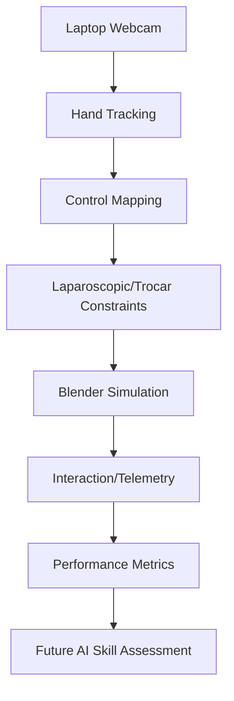

# Intended architecture

Design only: no components or transport are implemented in Phase 0.

| Stage | Intended responsibility |
| --- | --- |
| Webcam | Timestamped local frames; explicit camera start/stop |
| Hand tracking | Two-hand identities, landmarks, confidence, tracking-loss state |
| Control mapping | Calibration, handedness, coordinate conversion, filtering, instrument intent |
| Trocar constraints | Constrain each shaft through a fixed pivot; limit insertion and orientation |
| Blender simulation | Two instrument representations and eventual simplified task environment |
| Interaction/telemetry | Timestamped tool state, contact events, task events, tracking validity |
| Performance metrics | Reproducible descriptive measures with units and missing-data handling |
| Future AI assessment | Research-only analysis after data, consent, evaluation, and validation planning |

## Boundaries

Keep camera processing and independent control/constraint/metric logic in `src/lapsim_ai/`. Keep `bpy` integration in `blender/scripts/` and scenes in `blender/scenes/`. A possible future process boundary separates standalone CV Python from Blender's Python; transport and schema remain undecided. Process separation is an engineering choice, not a guarantee of license independence.

Before integration, specify coordinate axes, physical units, calibration, handedness, timestamps, sequence numbers, and stale-data behavior. Two-dimensional webcam observations do not directly establish reliable physical depth. The mapping must state its assumptions and limits.

Tracking loss must produce an explicit safe pause or freeze policy rather than uncontrolled movement. Test constraints and mapping with synthetic input before a camera is involved. Do not persist webcam frames by default; design any recording as an explicit future feature.

## Scope

The eventual initial scenario is simplified laparoscopic cholecystectomy. Anatomical fidelity, tissue mechanics, procedural correctness, and clinical validity are not established. Phase 1 should first validate instrument kinematics in a primitive environment, before anatomy or computer vision.
